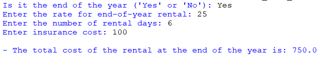
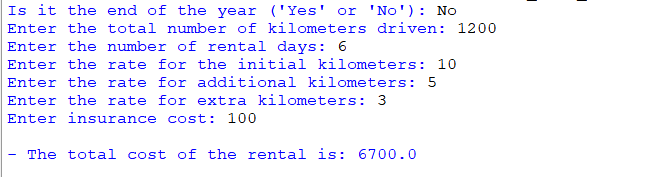

## Description
This program is for estimating car rental expenses. Users input kilometers, rental duration, and rates for different distances, including an option for end-of-year rentals. The program accurately computes total expenses, factoring in rates, insurance, and rental duration, providing detailed cost estimates for car rentals.

## Examples
♡ Example 1  

  

♡ Example 2  

